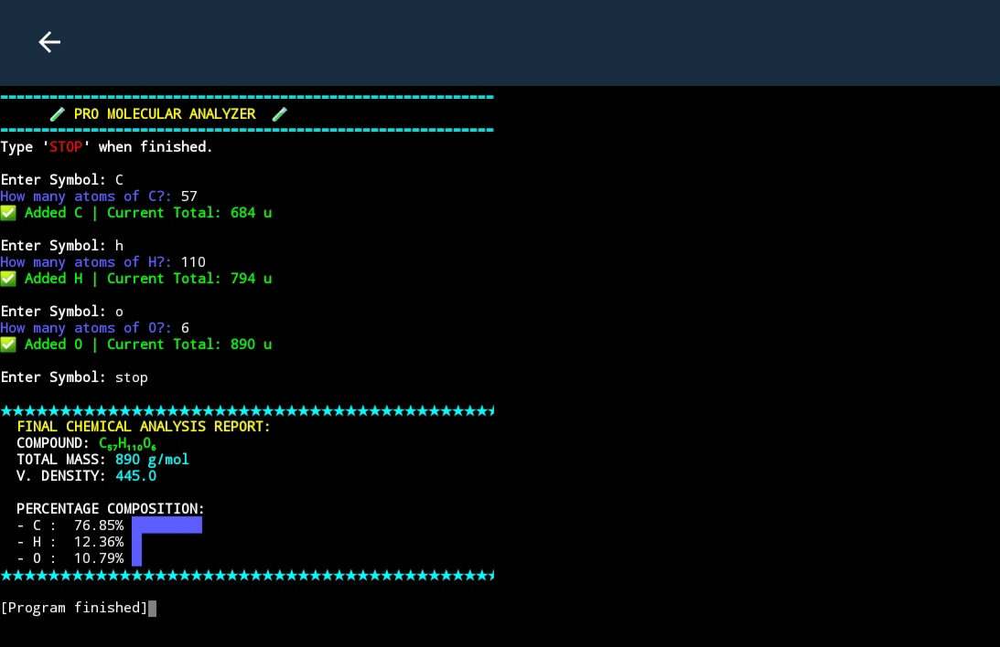

# 🧪 Molecular Mass & Vapour Density Calculator

A Python-based terminal application that calculates **molecular mass**, **vapour density**, and **percentage composition** of chemical compounds.

---

## 🚀 Features

* 🔬 Calculate molecular mass of compounds
* 🌫️ Compute vapour density using formula:
  VD = Molecular Mass / 2
* 📊 Shows percentage composition of each element
* 🧾 Clean and colorful terminal output
* ⚠️ Handles invalid input using error handling

---

## 🛠️ Technologies Used

* Python (Core concepts)
* Dictionary (Periodic Table data)
* Functions and loops
* Basic error handling (`try-except`)

---

## 📌 How It Works

1. User enters element symbols (e.g., H, O, Na)
2. Inputs number of atoms for each element
3. Program calculates:

   * Total Molecular Mass
   * Vapour Density
   * Percentage composition of each element

---

## ▶️ How to Run

1. Make sure Python is installed
2. Download or clone this repository
3. Run the file:

```bash
python Chemistry.py
```

---

## 📸 Sample Output



---

## 🎯 Future Improvements

* Accept full chemical formulas (e.g., H₂SO₄)
* Build a GUI version using Tkinter
* Convert into a web app using Flask

---

## 👨‍💻 Author

**Prateek Chhipa**

---

## ⭐ Note

This project was built while learning Python fundamentals and applying chemistry concepts.
It reflects my journey of combining **PCM knowledge with programming**.

---
